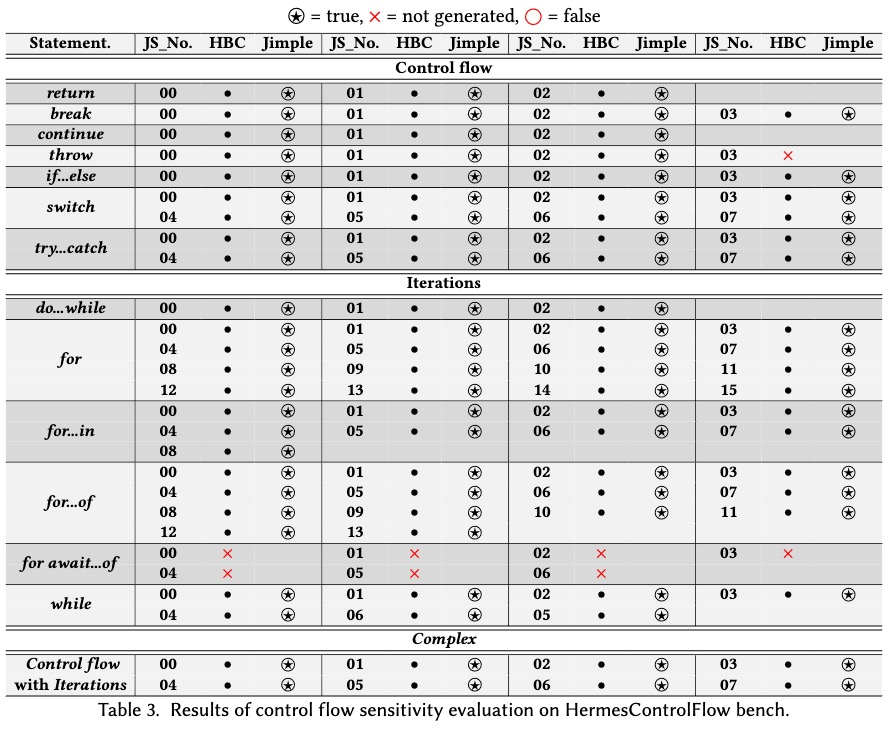

# HermesControlFlowBench

This benchmark is designed to evaluate the control flow recovery of the hermeser module for Soot. 

The benchmark involves 97 code samples involving both base cases originating from JavaScript statements and complex cases. We first collected a set of 89 JavaScript code examples, which were developed based on 13 essential JavaScript statements. These statements were sourced from the Mozilla Developer Network (MDN) documentation on statements and declarations in the JavaScript language. In the JavaScript documentation on the MDN, statements and declarations are grouped into five primary categories: control flow, declaring variables, functions and classes, iterations, and others. For the purpose of this benchmark, we particularly focus on the statements that impact the intraprocedural analysis breaking the top-to-bottom execution sequence. We specifically collected 89 code examples from the "Try it" and "Examples" sub-sections for each of 13 statements belonging to the control flow and iterations categories. The "Try it" section in each statement’s documentation is designed to provide an interactive code execution environment, helping readers grasp the functionality of the corresponding statements. The "Examples" section, on the other hand, emphasizes the diverse applications and use cases of each statement. This benchmark includes JavaScript code, the corresponding Hermes bytecode, and the generated Jimple code. The textual disassembly is also provided to aid in comprehending the transformation process from JavaScript to Hermes bytecode and subsequently to Jimple. It is important to note that the code examples for the 13 essential JavaScript statements often include a combination of multiple statement types, rather than solely focusing on the specific statement itself. Furthermore, to enhance the evaluation of complex intra-procedural behavior, we included an additional set of 8 code samples that specifically target scenarios involving a combination of control flow and iteration statements. These complex scenarios enable a more thorough examination of how our approach handles intricate intra-procedural patterns that arise from the interplay between different statement types.

<!--  -->

